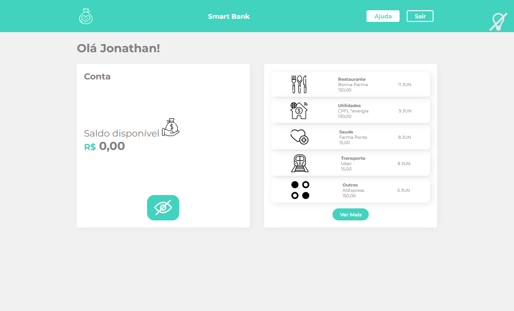

# Smart Bank
Utilizando todo o poder da biblioteca de estilo styled components foi criado esse pequeno layout chamado de Smart Bank. Totalmente componentizado, ele foi atribuido em forma de propriedades(props), atributos e váriaveis disponibilizadas na biblioteca [styled-components](https://styled-components.com/).


## Objetivos alcançados
- Como instalar o Styled Components dentro do projeto</li>
- Como criar um componente com o Styled Components
- Sobre a geração automática de classes
- Como transferir código CSS para meu componente estilizado
- Usando o reset global do projeto com o Styled Components
- Criando estilos globais para a aplicação
- Importando fontes do google para o projeto
- Criando variáveis para cores do projeto
- Utilizando propriedades em Componentes estilizados
- Porque usar inline styles é algo ruim
- Como usar Heranças de estilo
- Sobre possíveis problemas de performance caso um Styled Component seja declarado dentro de um outro componente React
- Como tratar de media queries dentro dos componentes estilizados
- Como compor elementos estilizados para criar novas telas
- Vantagens de usar componentes para criar layouts
- Utilizando styled components apenas para estilização
- Porque evitar o uso de switch-case
- Como organizar os temas do nosso projeto
- O que é o ThemeProvider do styledComponents
- Como alterar cores de icones SVG usando filters


## Instalação

```cmd
$ git clone https://github.com/PequenoJoohn/styled-components-react.git
$ cd styled-components-react
$ npm install ou yarn
$ npm run start ou yarn start

Have for fun
```